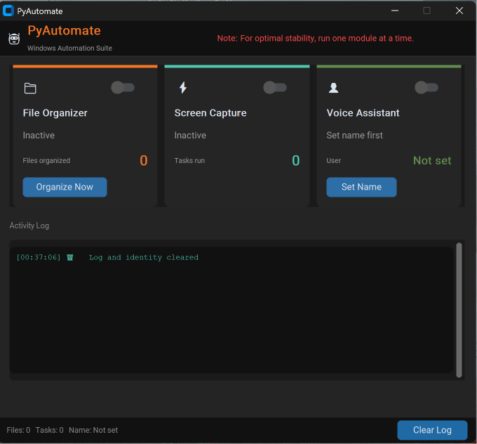
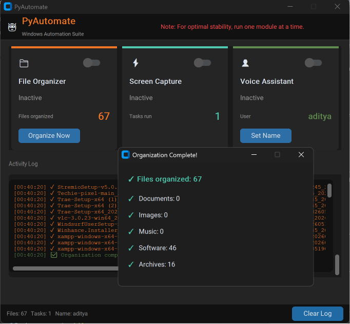
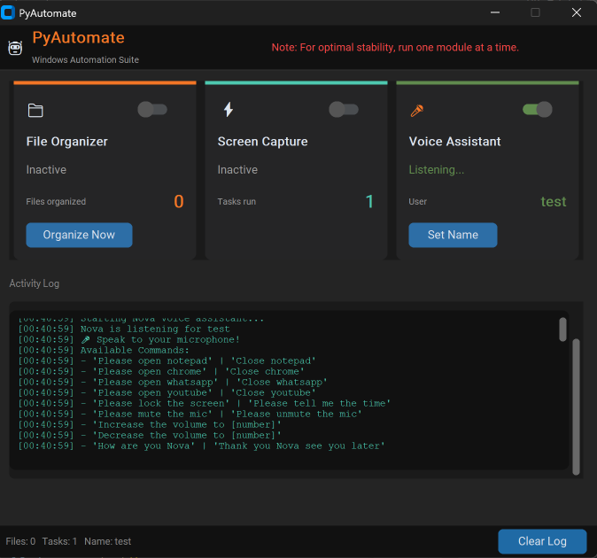
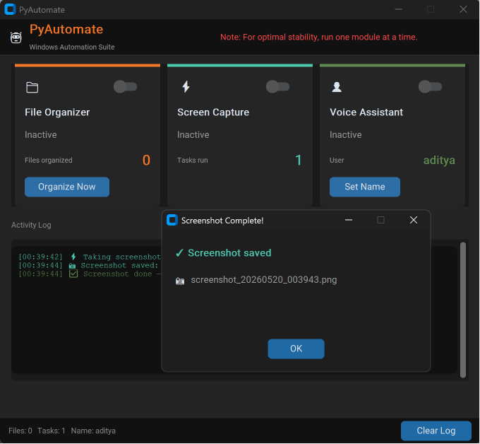

<div align="center">
  

  <h1> PyAutomate — Windows Automation Suite</h1>

  <p><strong>Premium Desktop Automation, File Organization & Voice Assistant Ecosystem</strong></p>

  <p>
    <a href="https://www.python.org/"></a>
    <a href="https://github.com/TomSchimansky/CustomTkinter"></a>
    <a href="https://pyautogui.readthedocs.io/"></a>
    <a href="https://pypi.org/project/SpeechRecognition/"></a>
  </p>

  <br/>

  > **Automate your workflow, clean up clutter, and control Windows with your voice — silently and dynamically.**

</div>

---

## Screenshots

<div align="center">
  <h3>Main Dashboard (Dark Mode Theme)</h3>
  
  
  <br/><br/>
  
  <h3>Smart File Organizer (Cleaned 67 files)</h3>
  
  
  <br/><br/>
  
  <h3>Voice Assistant in Listening Mode</h3>
  
  
  <br/><br/>
  
  <h3>Automated Screen Capture Complete</h3>
  
</div>

---

## About PyAutomate

**PyAutomate** is a premium, modern desktop utility application designed to streamline daily Windows operations. It provides a beautiful, unified CustomTkinter dark-mode graphical user interface containing three powerful execution modules:

1. **Smart File Organizer:** Automatically scans your designated directories (like Downloads), identifies file extensions, categorizes them, and moves them to organized subfolders (Documents, Images, Archives, Software, etc.) with safe retries to prevent locking issues.
2. **Automated Screen Capture:** Runs in the background at custom-scheduled intervals, silently logging workspace screenshots so you can review and audit your productivity metrics.
3. **Nova Voice Assistant:** A thread-safe, high-performance offline voice assistant that responds to natural vocal commands to lock screens, adjust volume levels, open websites, tell the current time, or forcefully terminate active applications.

---

## Key Features & Ecosystem

### Smart File Organizer
*   **Real-time Monitoring:** Actively watches folders for changes using Python's `watchdog` library.
*   **Intelligent Classification:** Uses a preconfigured file mapping schema to separate archives, codes, images, applications, and logs.
*   **Safe Transfer Pipeline:** Retries file operations if a downloaded file is still being written to by the system, avoiding corrupted movements.
*   **Macro Counters:** Tracks total files moved and dynamically prints status reports directly to the GUI popup.

### Automated Screen Capture
*   **Custom Scheduler:** Set screenshot intervals in seconds and maximum retention timeframes.
*   **Silent Capture:** Uses PIL/PyAutoGUI to capture screens without interrupting the user.
*   **Self-Cleanup Pipeline:** Automatically purges screenshots older than 30 days to save disk space.

### Nova Voice Assistant
*   **Thread-Safe COM Engine:** Communicates directly with the native Windows Speech API (SAPI5) via Python's `win32com` client.
*   **Lenient Command Recognition:** Uses fuzzy substring checks rather than rigid matching. The assistant naturally understands variations like `"lock screen"`, `"what's the time"`, or `"close chrome"`.
*   **Aggressive App Termination:** Uses PowerShell pipeline termination to forcefully close stubborn Win11 UWP apps (Notepad, WhatsApp) and standard Win32 executables.
*   **Active Tab Closing:** Automatically locates browser windows containing `"youtube"`, brings them to the foreground, and sends `Ctrl + W` to close the active tab.

---

## Technical Architecture & Stack

### Core Technologies

| Technology | Purpose |
|---|---|
| **Python 3.10+** | Base program runtime and execution flow |
| **CustomTkinter** | Premium modern dark-theme GUI wrappers |
| **Pywin32 / SAPI5** | Thread-safe native Windows speech synthesis and COM automation |
| **SpeechRecognition** | Online audio transcription engine |
| **Watchdog** | Low-level directory event monitoring |
| **PyAutoGUI** | Windows OS keyboard simulation, focus hooks, and mouse triggers |

### Deployment & Launcher

| Component | Role |
|---|---|
| **VBScript Wrapper** | Suppresses the black terminal console and launches Python directly |
| **WScript Shell Shortcut** | Generates a clean desktop icon pointing to the VBS launcher |

---

## Project Structure

```
Desktop automator/
│
├── PyAutomate/                    # Application source code
│   ├── __pycache__/
│   ├── config.py                  # Directory maps & scheduling configuration
│   ├── file_organizer.py          # Watchdog file grouping engine
│   ├── gui.py                     # CustomTkinter interface & background threads
│   ├── main.py                    # Entry point & console hider
│   ├── profile_store.py           # User preference settings (Name / Voice)
│   ├── requirements.txt           # Main python dependency manifest
│   ├── system_commander.py        # Voice assistant & Windows controls
│   └── task_automator.py          # Screen capture & database manager
│
├── screenshots/                   # Project UI screenshots
│   ├── media__1779217648306.png   # Main Inactive GUI
│   ├── media__1779217843418.png   # File Organizer Popup
│   ├── media__1779217891807.png   # Voice Assistant Active
│   └── media__1779217808646.png   # Screenshot Saved Popup
│
├── run_hidden.vbs                 # Silent background startup launcher
├── .gitignore                     # Git exclusion rules
└── README.md                      # Documentation
```

---

## Installation & Local Setup

### Prerequisites

*   **Operating System:** Windows 10 or 11
*   **Python:** Version 3.10 or higher
*   **Microphone:** Enabled system audio input device

---

### Step-by-Step Setup

#### 1. Clone the Repository
```bash
git clone https://github.com/yourusername/Desktop-automator.git
cd "Desktop automator"
```

#### 2. Create a Virtual Environment
```bash
# Initialize venv
python -m venv .venv

# Activate venv
.venv\Scripts\activate
```

#### 3. Install Dependencies
```bash
pip install -r PyAutomate/requirements.txt
```

#### 4. Run the Application
To run it directly with standard output/console visible:
```bash
python PyAutomate/main.py
```

---

## Supported Voice Commands

The **Nova Voice Assistant** supports these natural verbal triggers:

| Category | Phrase Variations | Description |
|---|---|---|
| **System Info** | `"tell me the time"`, `"what's the time"`, `"current time"` | Speaks the current local time |
| **System State** | `"lock the screen"`, `"lock screen"` | Safely locks the Windows user session |
| **Audio Control** | `"mute the mic"`, `"mute mic"`, `"mute audio"` | Mutes system speaker audio |
| **Audio Control** | `"unmute the mic"`, `"unmute mic"`, `"unmute audio"` | Unmutes system speaker audio |
| **Volume Leveling**| `"increase the volume to [number]"` | Sets volume to a specific integer level (0-100) |
| **Volume Leveling**| `"decrease the volume to [number]"` | Sets volume to a specific integer level (0-100) |
| **App Launching** | `"open notepad"`, `"open chrome"`, `"open whatsapp"`, `"open youtube"` | Opens target application or website |
| **App Closing** | `"close notepad"`, `"close whatsapp"`, `"close chrome"` | Forcefully terminates target application |
| **Tab Control** | `"close youtube"` | Automatically focuses Chrome/Edge YouTube window and closes it |

---

## Contributing

1. **Fork** the repository.
2. **Create** a branch: `git checkout -b feature/your-feature-name`
3. **Commit** your changes: `git commit -m "feat: add feature explanation"`
4. **Push** to the branch: `git push origin feature/your-feature-name`
5. **Open** a Pull Request.

---

<div align="center">

  **Built with ❤️ to automate your daily Windows workspace**

</div>
